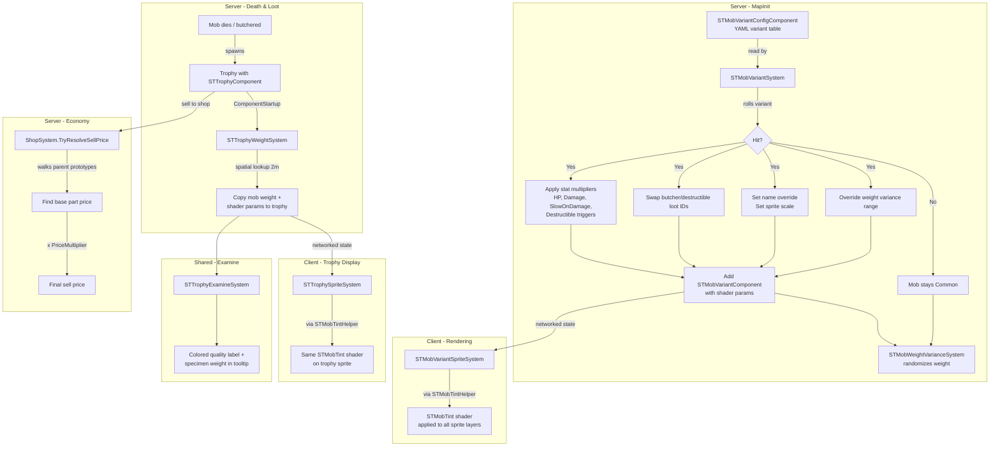

# Mob Variant and Trophy System

> Procedurally promotes spawned mutant mobs into quality tiers (Uncommon / Rare / Legendary) with scaled stats, visual tints, and higher-value trophy drops, giving the Zone its "rare hunt" loop without requiring unique sprite assets per variant.

[< Back to Home](Home)

## Motivation

**Before this system**, every mob of a given species was mechanically identical. Creating "elite" mutants required hand-authoring entire new entity prototypes with different stats and sprites, then wiring them into every spawner and pack definition. That approach does not scale (28+ species, each needing 3-4 quality variants) and creates a maintenance burden where stat rebalancing requires touching dozens of files.

**The design goal**: a content author adds a single `STMobVariantConfig` component to a mob prototype, defines probability/stat curves per tier, and the system handles everything at runtime: stat scaling, visual differentiation, loot replacement, weight variance, shop pricing, and examine text.

## Design Decisions

- **In-place mutation, not entity replacement**: When a mob is promoted, the system modifies the existing entity's components rather than despawning/respawning. This preserves `EntityUid` handles held by spawners and NPC pack references.

- **Cumulative probability with early exit**: Variant chances are evaluated top-to-bottom as a cumulative distribution. If no variant hits, the mob stays Common. Ordering in `variants:` matters (higher-probability entries first). The system logs a warning if chances sum above 1.0.

- **Config component is consumed on use**: `STMobVariantConfigComponent` is removed after MapInit processing. It exists only to carry YAML data into the system. Runtime state lives in `STMobVariantComponent`.

- **Shader-based visuals, not unique sprites**: A fragment shader (`STMobTint`) adjusts brightness, saturation, and tint color per sprite layer. Adding visual variety to a new mob species is a YAML-only task.

- **Spatial lookup for trophy inheritance**: When a trophy spawns from butchering, it needs the source mob's weight and shader parameters. Rather than modifying upstream `ButcherableSystem`, `STTrophyWeightSystem` performs a spatial lookup for the nearest mob within 2m. This avoids upstream code changes at the cost of a slightly fragile spatial assumption.

- **Prototype parent-chain price resolution**: Variant trophy parts are children of the base mutant part (e.g., `STMutantPartUncommonBlindDogTail` parents `MutantPartBlindDogTail`). The sell-price resolver walks the prototype parent chain until it finds a listed ancestor, then applies `PriceMultiplier`. Shops only need to list base part IDs.

## Mental Model

Think of the system as a **post-spawn modifier pipeline**:

```
Mob spawns (MapInit)
    |
    v
[STMobVariantSystem]   Roll dice against variant table
    |                     If hit: scale HP, damage, speed thresholds, size, name, loot table
    |                     Apply STMobVariantComponent with shader params
    |                     Always: remove config component
    v
[STMobWeightVarianceSystem]   Randomize weight within tier-specific range
    |                           (runs AFTER variant system via event ordering)
    v
Entity lives its life, looking visually distinct to clients via shader
    |
    v
Mob dies, player butchers it
    |
    v
Trophy item spawns with STTrophyComponent
    |
    v
[STTrophyWeightSystem]   Spatial lookup copies mob weight + shader params to trophy
    |
    v
[STTrophyExamineSystem]   Player examines trophy, sees colored quality label + weight
    |
    v
[ShopSystem.TryResolveSellPrice]   Sell price = base ancestor price x PriceMultiplier
```

The **client side** is simpler: `STMobVariantSpriteSystem` and `STTrophySpriteSystem` both use `STMobTintHelper` to apply the shader to mob and trophy sprites respectively, triggered by networked component state updates.

## Architecture

### Component Roles

| Component | Location | Lifetime | Purpose |
|-----------|----------|----------|---------|
| `STMobVariantConfigComponent` | Shared | MapInit only (removed after processing) | YAML-authored variant table: chances, multipliers, tint params, loot swaps |
| `STMobVariantComponent` | Shared (networked) | Entity lifetime | Runtime marker: quality tier + shader params. Prevents re-rolling. Networks tint to clients |
| `STMobWeightVarianceComponent` | Shared | MapInit only (removed after processing) | Weight randomization range. Variant system can override its min/max |
| `STTrophyComponent` | Shared (networked) | Entity lifetime | Quality tier, price multiplier, source mob weight, inherited shader params |

### System Roles

| System | Side | Responsibility |
|--------|------|----------------|
| `STMobVariantSystem` | Server | Rolls variants on MapInit, applies stat/loot/visual modifications |
| `STMobWeightVarianceSystem` | Server | Randomizes mob weight within a range (runs after variant system) |
| `STTrophyWeightSystem` | Server | On trophy ComponentStartup, spatial-lookups nearest mob, copies weight + shader data |
| `STTrophyExamineSystem` | Shared | Adds colored quality label and specimen weight to examine tooltip |
| `STMobVariantSpriteSystem` | Client | Applies `STMobTint` shader to variant mob sprites |
| `STTrophySpriteSystem` | Client | Applies `STMobTint` shader to trophy sprites |
| `ShopSystem` (partial) | Server | `TryResolveSellPrice` walks prototype parents and applies `PriceMultiplier` |

### Data Flow Diagram



### The STMobTint Shader

The fragment shader (`Resources/Textures/Shaders/_Stalker_EN/st_mob_tint.swsl`) performs three operations in order:

1. **Brightness**: Multiplies RGB by the brightness uniform (1.0 = no change)
2. **Saturation**: Mixes between luminance-preserving greyscale and current color (0 = greyscale, 1 = original, >1 = vivid)
3. **Tint**: Multiplicative color blend with the tint uniform

This order matters: brightness before saturation ensures bright-but-desaturated variants (like Rare tier's washed-out look) render correctly.

## Quality Tiers

| Quality | In-game Name | Examine Color | Typical Chance | Stat Multipliers | Price Multiplier |
|---------|-------------|---------------|----------------|------------------|-----------------|
| Common | "Standard" | Gray `#808080` | ~90% (remainder) | 1.0x (no change) | 1.0x |
| Uncommon | "Adapted" | Green `#00FF00` | ~8% | 1.1x HP, 1.1x Dmg | 1.5x |
| Rare | "Mutated" | Blue `#4169E1` | ~2% | 1.2x HP, 1.2x Dmg | 3.7x |
| Legendary | "Singular" | Gold `#FFD700` | ~0.1% | 1.3x HP, 1.3x Dmg | 11.1x |

> **Warning**: These values are per-species, defined in each mob's YAML. The table above reflects the most common convention. Always check the specific prototype.

### Visual Identity by Tier

- **Uncommon ("Adapted")**: Warm/earthy tint, increased saturation, slightly darker. "Hardened survivors."
- **Rare ("Mutated")**: Cool/pale tint, heavily desaturated, brighter. Unnaturally bleached or frost-touched.
- **Legendary ("Singular")**: Vivid hot tint (reds, golds), high saturation, moderate brightness. Immediately alarming.

## How to Extend

### Adding variants to an existing mob species

YAML-only task, no C# changes required.

**Step 1**: Add `STMobVariantConfig` to the mob prototype:

```yaml
# e.g., Resources/Prototypes/_Stalker/Entities/Mobs/Mutants/T2/snork.yml
- type: entity
  id: MobMutantSnork
  # ... existing components ...
  # Stalker-EN start
  - type: STMobVariantConfig
    variants:
    - chance: 0.08
      quality: Uncommon
      nameOverride: st-mob-variant-uncommon-snork
      healthMultiplier: 1.1
      damageMultiplier: 1.1
      spriteScale: 1.05
      spriteTint: "#604020FF"
      spriteSaturation: 1.3
      spriteBrightness: 0.8
      minWeightMultiplier: 0.95
      maxWeightMultiplier: 1.25
      butcherSwaps:
        MutantPartSnorkHand: STMutantPartUncommonSnorkHand
    - chance: 0.02
      quality: Rare
      nameOverride: st-mob-variant-rare-snork
      healthMultiplier: 1.2
      damageMultiplier: 1.2
      spriteScale: 1.1
      spriteTint: "#C0D0FFFF"
      spriteSaturation: 0.2
      spriteBrightness: 1.5
      minWeightMultiplier: 1.1
      maxWeightMultiplier: 1.4
      butcherSwaps:
        MutantPartSnorkHand: STMutantPartRareSnorkHand
    - chance: 0.001
      quality: Legendary
      nameOverride: st-mob-variant-legendary-snork
      healthMultiplier: 1.3
      damageMultiplier: 1.3
      spriteScale: 1.15
      spriteTint: "#FF3020FF"
      spriteSaturation: 1.4
      spriteBrightness: 1.2
      minWeightMultiplier: 1.3
      maxWeightMultiplier: 1.6
      butcherSwaps:
        MutantPartSnorkHand: STMutantPartLegendarySnorkHand
  # Stalker-EN end
```

**Step 2**: Create variant trophy part prototypes (in `Resources/Prototypes/_Stalker_EN/Entities/Objects/MutantParts/`):

```yaml
# snork_variant_parts.yml
- type: entity
  parent: MutantPartSnorkHand
  id: STMutantPartUncommonSnorkHand
  name: Adapted Snork Hand
  description: A snork hand showing signs of advanced Zone adaptation...
  components:
  - type: STTrophy
    quality: Uncommon
    priceMultiplier: 1.5

- type: entity
  parent: MutantPartSnorkHand
  id: STMutantPartRareSnorkHand
  name: Mutated Snork Hand
  description: An eerily pale snork hand with crystalline growths...
  components:
  - type: STTrophy
    quality: Rare
    priceMultiplier: 3.7

- type: entity
  parent: MutantPartSnorkHand
  id: STMutantPartLegendarySnorkHand
  name: Singular Snork Hand
  description: A blood-red snork hand that pulses with residual warmth...
  components:
  - type: STTrophy
    quality: Legendary
    priceMultiplier: 11.1
```

**Step 3**: Add locale strings (in `Resources/Locale/en-US/_Stalker_EN/trophy/trophy.ftl`):

```
st-mob-variant-uncommon-snork = Adapted Snork
st-mob-variant-rare-snork = Mutated Snork
st-mob-variant-legendary-snork = Singular Snork
```

**Step 4**: Create GM-spawnable variant prototypes (in `Resources/Prototypes/_Stalker_EN/Entities/Mobs/Mutants/T2/`):

```yaml
# snork_variants.yml
- type: entity
  parent: MobMutantSnork
  id: STMobMutantSnorkCommon
  name: Snork
  suffix: ST, T2, Common
  components:
  - type: STMobVariant
    quality: Common
    applied: true    # Already processed, no re-rolling

- type: entity
  parent: MobMutantSnork
  id: STMobMutantSnorkUncommon
  name: Adapted Snork
  suffix: ST, T2, Adapted
  components:
  - type: STMobVariant
    quality: Uncommon  # applied defaults to false; system finds matching entry and applies

- type: entity
  parent: MobMutantSnork
  id: STMobMutantSnorkRare
  name: Mutated Snork
  suffix: ST, T2, Mutated
  components:
  - type: STMobVariant
    quality: Rare

- type: entity
  parent: MobMutantSnork
  id: STMobMutantSnorkLegendary
  name: Singular Snork
  suffix: ST, T2, Singular
  components:
  - type: STMobVariant
    quality: Legendary
```

> **Tip**: GM-spawnable variants use `STMobVariantComponent` with a specific `quality` but `applied: false`. On MapInit, `STMobVariantSystem` detects the pre-existing component, looks up the matching variant entry, and applies those stats deterministically. The Common variant sets `applied: true` to skip processing entirely.

### Integrating a new loot drop mechanism

If a mob drops parts through `DestructibleComponent` (`SpawnEntitiesBehavior`) instead of `ButcherableComponent`, the variant system already handles this. `SwapDestructibleLoot` mirrors `SwapButcherableLoot`. Use the same `butcherSwaps` map in YAML.

### Adjusting balance

All balance levers are in YAML. There is no global multiplier (intentional, because a 1.2x HP boost on a 50 HP blind dog differs greatly from 1.2x on a 2300 HP chimera). Content authors tune per-species.

## Gotchas

### Event ordering between variant and weight systems

`STMobWeightVarianceSystem` subscribes to `MapInitEvent` with `after: [typeof(STMobVariantSystem)]`. This is critical because the variant system may override weight variance min/max values. If the weight system ran first, it would use default ranges for every tier.

For new systems that need to run after variant processing:

```csharp
SubscribeLocalEvent<YourComponent, MapInitEvent>(OnMapInit, after: [typeof(STMobVariantSystem)]);
```

### Trophy spatial lookup radius

`STTrophyWeightSystem` searches within `2.0f` meters. If two mobs die near each other and both are butchered, a trophy could pick up the wrong mob's data. In practice this is rare due to DoAfter timing.

### The `Applied` flag prevents double-processing

`STMobVariantComponent.Applied` serves two purposes:
1. Set to `true` in YAML (Common GM-spawnable variants): tells the system "already done, skip."
2. Set to `false` with a specific `Quality` (non-Common GM-spawnable variants): tells the system "apply the matching variant entry deterministically."

### Variant trophy parts must parent the base part

The shop price resolution walks the prototype parent chain. If a variant part does not eventually parent the base part listed in shops, it will not be sellable.

### The config component is removed after MapInit

Do not read `STMobVariantConfigComponent` at runtime. All runtime state is on `STMobVariantComponent`. To check what variants were possible, look up the original prototype.

### Shader caching in client systems

`STMobVariantSpriteSystem` and `STTrophySpriteSystem` maintain per-entity shader parameter caches to avoid recreating shader instances on every PVS update. Caches are cleaned on `ComponentRemove`. If a mob's tint does not update, verify `Dirty()` is being called on the server.

### DestructibleComponent is server-only

When the variant system scales `DamageTrigger` thresholds or swaps `SpawnEntitiesBehavior` entries in `DestructibleComponent`, it does not call `Dirty()`. This is correct: `DestructibleComponent` is not networked.

### ButcherableComponent *is* networked

After swapping loot entries, the system calls `Dirty(uid, butcherable)`. If you add new modifications to butcherable data, remember to dirty it.

## Related Systems

| System | Relationship |
|--------|-------------|
| **STWeightSystem** (`Content.Shared/_Stalker/Weight/`) | Variant system modifies `STWeightComponent.Self` indirectly via `STMobWeightVarianceSystem`. Trophy system reads it for examine display. |
| **MobThresholdSystem** | Used to scale HP thresholds programmatically. |
| **SharedScaleVisualsSystem** | Used for sprite scaling. Variant system multiplies against existing scale. |
| **ButcherableSystem** | Upstream butchering system. Variant system modifies its spawned entity list. The spatial lookup avoids changing the butcher event chain. |
| **ShopSystem** (`Content.Server/_Stalker/Shop/`) | `ShopSystem.Trophy.cs` adds `TryResolveSellPrice` for trophy pricing integration. |
| **DestructibleSystem** | Some mobs drop parts through destructible behaviors. Variant system swaps these entries too. |

## Key Files Reference

| File | Purpose |
|------|---------|
| `Content.Shared/_Stalker_EN/MobVariant/STMobVariantConfigComponent.cs` | YAML-authored variant table (consumed on init) |
| `Content.Shared/_Stalker_EN/MobVariant/STMobVariantComponent.cs` | Runtime networked marker: quality + shader params |
| `Content.Shared/_Stalker_EN/MobVariant/STMobWeightVarianceComponent.cs` | Weight randomization range |
| `Content.Server/_Stalker_EN/MobVariant/STMobVariantSystem.cs` | Core server logic: roll variants, apply modifications |
| `Content.Server/_Stalker_EN/MobVariant/STMobWeightVarianceSystem.cs` | Server weight randomizer (runs after variant system) |
| `Content.Shared/_Stalker_EN/Trophy/STTrophyComponent.cs` | Trophy data: quality, price multiplier, source weight, shader params |
| `Content.Shared/_Stalker_EN/Trophy/STTrophyQuality.cs` | `enum STTrophyQuality { Common, Uncommon, Rare, Legendary }` |
| `Content.Shared/_Stalker_EN/Trophy/STTrophyExamineSystem.cs` | Colored quality label + weight in examine tooltip |
| `Content.Server/_Stalker_EN/Trophy/STTrophyWeightSystem.cs` | Spatial lookup: copies mob data to trophy at spawn |
| `Content.Server/_Stalker_EN/Shop/ShopSystem.Trophy.cs` | Prototype parent-chain price resolution with trophy multiplier |
| `Content.Client/_Stalker_EN/MobVariant/STMobVariantSpriteSystem.cs` | Applies STMobTint shader to variant mob sprites |
| `Content.Client/_Stalker_EN/Trophy/STTrophySpriteSystem.cs` | Applies STMobTint shader to trophy sprites |
| `Content.Client/_Stalker_EN/Shaders/STMobTintHelper.cs` | Shared shader application logic with per-entity caching |
| `Resources/Textures/Shaders/_Stalker_EN/st_mob_tint.swsl` | Fragment shader: brightness, saturation, tint |
| `Resources/Prototypes/_Stalker_EN/Shaders/st_mob_tint.yml` | Shader prototype definition |
| `Resources/Locale/en-US/_Stalker_EN/trophy/trophy.ftl` | Trophy quality names and variant mob name overrides |
| `Resources/Prototypes/_Stalker_EN/Entities/Mobs/Mutants/` | Per-tier variant mob prototypes (GM-spawnable) |
| `Resources/Prototypes/_Stalker_EN/Entities/Objects/MutantParts/` | Variant trophy part prototypes |
| `Resources/Prototypes/_Stalker/Entities/Mobs/Mutants/base.yml` | Base mutant prototype (has `STMobWeightVariance`) |
